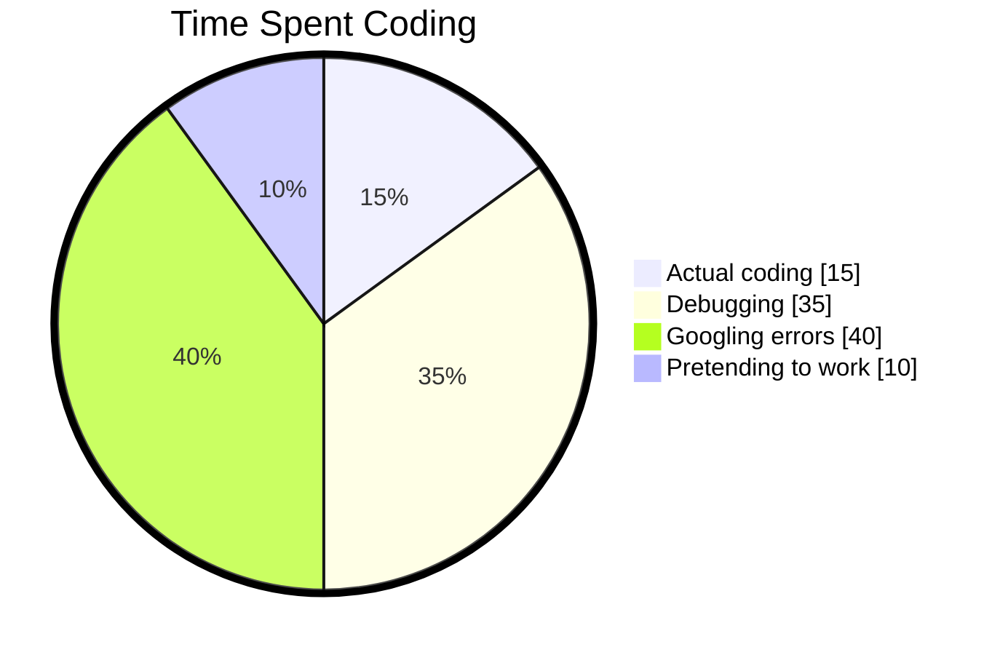

# 👨‍💻 Ronald Onyango - Data Whisperer & Pipeline Poet

<div align="center">
  
</div>

<div align="center" style="margin: 20px 0">
  <a href="https://www.linkedin.com/in/ronaldonyango/">
    
  </a>
  <a href="mailto:ronaldonyango.ke@gmail.com">
    
  </a>
  <a href="https://www.kaggle.com/ronaldonyango">
    
  </a>
  <a href="https://medium.com/@ronaldonyango">
    
  </a>
</div>

---

## 🎭 About Me - The human edition

> **"I speak fluent SQL, broken Python, and occasional coherent sentences"**

Hey! I'm Ronald - part data plumber, part insight magician, and full-time chaos organizer. By day I fight dirty data dragons, by night I write Medium posts no one reads 😅. 

**My superpowers:**
- Transforming "Where's the report?" panic into beautiful dashboards
- Automating tasks so humans can do more human things (like drink coffee)
- Spotting data patterns like Where's Waldo champion
- Explaining technical jargon to managers without causing existential dread

**Current life status:** 
```python
while coffee_level > 0:
    code()
    debug()
    complain_about_legacy_systems()
else:
    more_coffee = True
```

**Product philosophy:**
> "If users aren't complaining about your first prototype, you waited too long to ship"

---

## Tech Stack (My Digital Toolbelt)

### Daily drivers
<p>
  
  
  
</p>

### Data taming tools
<p>
  
  
  
</p>

### Making pretty pictures
<p>
  
  
  
</p>

### Cloud stuff I'm figuring out
<p>
  
  
  
</p>

### Things I Google daily
<p>
  
  
</p>

---

## Projects That Didn't Completely Explode

| Project | What I built | What actually happened |
|---------|-------------|------------------------|
| 🧠 **Suicide Prevention Analysis** | Beautiful socioeconomic insights | Discovered my CSV was 0.0001% corrupted 😱 |
| 🔄 **Data Export Tool** | Elegant CLI automation | Became team's favorite "magic button" ✨ |
| 🌐 **Web Analytics Pipeline** | Real-time dashboard paradise | Learned why "eventual consistency" exists ☕ |

<div align="center" style="margin-top:20px">
  <a href="https://www.datascienceportfol.io/ronaldonyango">
    
  </a>
</div>

---

## Blogging (My therapy sessions)

<!-- BLOG-POST-LIST:START -->
- [My SQL queries were longer than my patience](https://medium.com/@ronaldonyango/my-sql-queries-were-longer-than-my-patience-c7727219bd93?source=rss-b646665c09cd------2)
- [SQLThe Language I Love to Hate &lpar;and Hate to Love&rpar;](https://medium.com/@ronaldonyango/sqlthe-language-i-love-to-hate-and-hate-to-love-69f84f435312?source=rss-b646665c09cd------2)
- [Mapping Suicide Rates Worldwide: Analyzing 30 Years of Socioeconomic Factors](https://medium.com/@ronaldonyango/mapping-suicide-rates-worldwide-analyzing-30-years-of-socioeconomic-factors-c485fcc16407?source=rss-b646665c09cd------2)
- [Global suicide rates analysis](https://medium.com/@ronaldonyango/global-suicide-rates-analysis-4480af7754fd?source=rss-b646665c09cd------2)
- [How I would learn SQL if I started again](https://medium.com/@ronaldonyango/how-i-would-learn-sql-if-i-started-again-15a45aafeff5?source=rss-b646665c09cd------2)
<!-- BLOG-POST-LIST:END -->

<div align="center">
  <a href="https://medium.com/@ronaldonyango">
    
  </a>
</div>

---

## Kaggle Datasets

### Global Suicide Rates (1990-2022)
[]()
[]()

---

## GitHub Reality Check

<div align="center">

### Time spent coding reality



</div>

---

<div align="center">

## ☕ Let's create something awful together!

<a href="https://www.linkedin.com/in/ronaldonyango/">
  
</a>

**Perfect if you:**
- Have data problems that keep you up at night
- Want to debate tabs vs spaces (tabs obviously)
- Need someone to laugh at your database schema  
- Just want to vent about stakeholder requests

---


<p><i>"I don't always test my code, but when I do, I do it in production"</i> 🫣</p>

<p>Made with ❤️, ☕, and probably too many pandas references</p>

</div>
