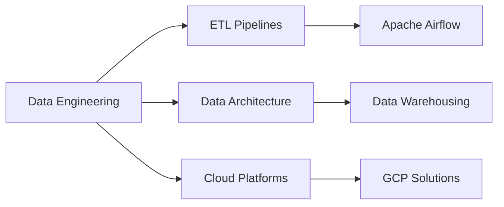

# Hey there! I'm Ronald Onyango 👋

  

  

---

## 🚀 About Me

**Data Engineering Enthusiast** from **Nairobi, Kenya** 🇰🇪

*"Extracting insights from data, one line of code at a time"*

🎯 **Always eager for new challenges**

### 💼 What I Do
- 🔍 **Data Engineering** - Building robust data pipelines and architectures
- 📊 **Data Analysis** - Turning raw data into actionable insights  
- 🛠️ **Process Automation** - Streamlining workflows with smart tools
- 📈 **Visualization** - Creating compelling data stories

---

## 🛠️ Tech Stack

### Core Technologies

### Data Engineering & Analysis

### Visualization & BI

### Cloud & Databases

### Tools & Other

---

## 📊 Featured Projects

<table>
<tr>
<td width="50%">

### 🧠 Suicide Prevention Analysis
**Understanding Mental Health Through Data**

- 📈 Analyzed 30 years of global suicide data
- 🎯 Identified vulnerable age groups (35-54, Silent Generation)
- 💡 Revealed economic factors' impact on mental health
- 🛠️ **Tech:** Python, Pandas, Matplotlib, Data Analysis

</td>
<td width="50%">

### 🔄 Data Export & Scheduling Tool
**Automating Data Workflows**

- ⚡ Automated database exports (CSV, XLSX, JSON)
- ⏰ Scheduled recurring data exports
- 🖥️ User-friendly CLI interface
- 🛠️ **Tech:** Python, SQL, Automation, CLI

</td>
</tr>
</table>

  

---

## 📝 Latest Blog Posts

<!-- BLOG-POST-LIST:START -->
- 📊 [Mapping Suicide Rates Worldwide: Analyzing 30 Years of Socioeconomic Factors](https://medium.com/@ronaldonyango/mapping-suicide-rates-worldwide-analyzing-30-years-of-socioeconomic-factors-c485fcc16407?source=rss-b646665c09cd------2)
- 🌍 [Global suicide rates analysis](https://medium.com/@ronaldonyango/global-suicide-rates-analysis-4480af7754fd?source=rss-b646665c09cd------2)
- 💡 [How I would learn SQL if I started again](https://medium.com/@ronaldonyango/how-i-would-learn-sql-if-i-started-again-15a45aafeff5?source=rss-b646665c09cd------2)
- 🚀 [How I became a Data Analyst in just 3 months](https://medium.com/@ronaldonyango/mastering-sql-tools-and-data-engineering-a-self-taught-analysts-journey-6cd36e49c8ed?source=rss-b646665c09cd------2)
<!-- BLOG-POST-LIST:END -->

  

---

## 🏆 Kaggle Achievements

  

---

## 📈 GitHub Analytics

  

  

---

## 🎯 Current Focus

---

## 💬 Let's Connect!

I'm always excited to collaborate on data projects or discuss the latest in tech! 
Feel free to reach out for:

🤝 **Collaboration Opportunities**  
💡 **Data Engineering Discussions**  
📚 **Knowledge Sharing**  
☕ **Virtual Coffee Chats**

---

**⭐ Don't forget to star interesting repositories!**

*"Data is the new oil, but insights are the refined fuel that powers decisions."*

  

