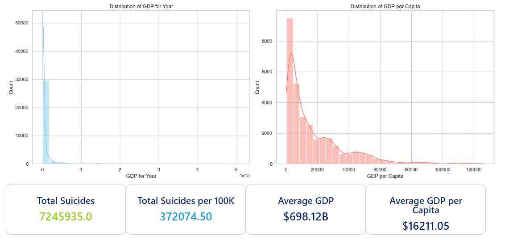
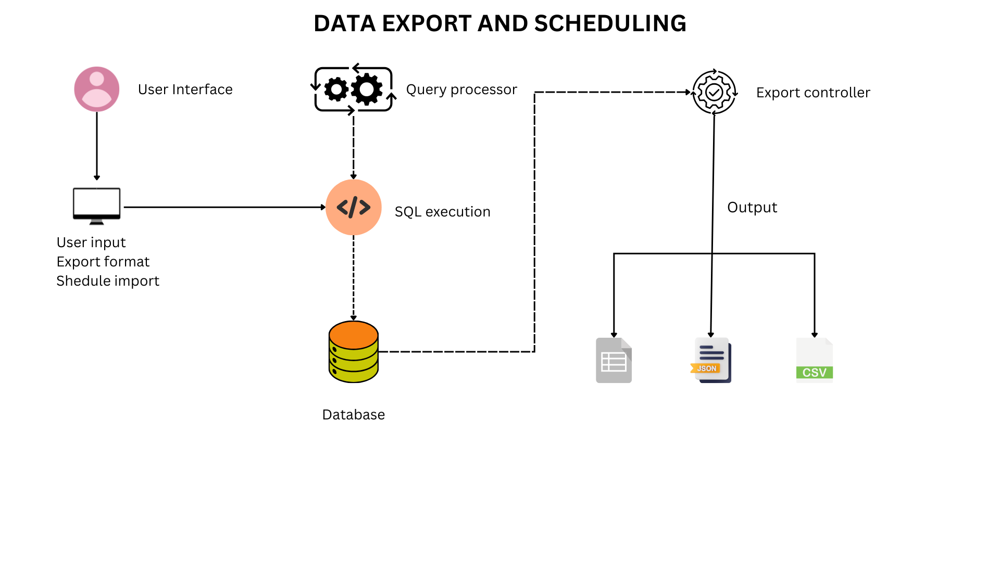

<!-- Introduction Section -->
# Hey there! 👋 I'm Ronald Onyango, a Data Enthusiast.

I transform data into insights, one line of code at a time. Currently riding the data wave, specializing in Data Engineering and always hungry for new challenges.

---

### Connect with me
&nbsp;&nbsp;&nbsp;&nbsp;&nbsp;&nbsp;[🌐](https://www.datascienceportfol.io/ronaldonyango)

<!-- Tools Section -->
### 💻 Tech Stack

 
 

---

<!-- Project Section -->
### 🚀 Portfolio

#### [Suicide Prevention](https://www.datascienceportfol.io/ronaldonyango/projects/5)

In this project, I conducted a thorough analysis of suicide trends, highlighting vulnerable groups like those aged 35-54 and the Silent generation. The findings emphasize the need for holistic approaches, targeted interventions based on age and gender, and the crucial link between economic factors and mental health. See [suicide-rates-eda repository](https://github.com/ronaldonyango/suicide-rates-eda/blob/main/suicide-rates-eda.ipynb) for more details.

###### ***Python | Data modelling | Data visualization***

 
 

#### [Data Export & Scheduling Tool](https://www.datascienceportfol.io/ronaldonyango/projects/5)

The Data Export and Scheduling Tool is a professional command-line utility designed to facilitate data export from databases to multiple formats (including CSV, XLSX, and JSON) and enable scheduled recurring exports. It offers users a convenient solution for automating data exports from both database tables and queries. See [data-export-tool repository](https://github.com/ronaldonyango/suicide-rates-eda/blob/main/data-exports-tool.ipynb) for more details.

###### ***SQL | Python | Database manipulation | Data visualization***
 
 
 
 

---

<!-- GitHub Stats Section -->
### 📊 My GitHub stats

---

<!-- Footer Section -->
Feel free to roam around my GitHub repositories and drop me a line for a chat or collaboration! 🚀 Whether it's serious coding or just nerding out over the latest tech, I'm always up for it.😄
